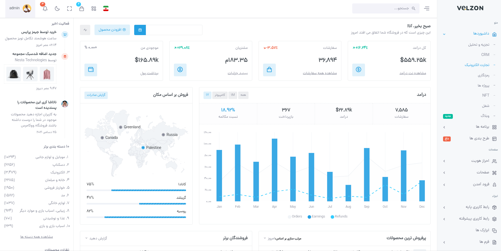

<div align="center">
<h1 align="center">Django shop 5.2 Template</h1>
<h3 align="center">نمونه پروژه برای اپلیکیشن فروشگاهی به عنوان دمو</h3>
</div>
<p align="center">
<a href="https://www.python.org" target="_blank">  </a>

<a href="https://www.postgresql.org" target="_blank">  </a>
<a href="https://git-scm.com/" target="_blank">  </a>
<a href="https://www.nginx.com" target="_blank">  </a>
<a href="https://www.docker.com/" target="_blank">  

</p>


# Demo
Sample project for a chatroom application as demo



# Development usage

First, you just need to create a virtual environment.
```
python3 -m venv .venv (hint --> create command in linux)
```
Installing the packages required for the project
```
pip install -r requirements.tx
or 
pip --index-url pip install --index-url https://mirror-pypi.runflare.com/simple -r requirements.txt
```
next you can run the necessary commands for anything like makemigrations and migrate:

```
python manage.py makemigrations 
python manage.py migrate
```

There is a file named .env.sample which is the variables file for the project.

``
vim .env or touch .env
``

# Production usage
```commandline
cd dockerfile/base_image
```

```commandline
docker build -t leno_image:1.0.0 .
```

second --> create file .env and db.env for environment backend and postgres
```commandline
touch .env
touch db.env
```
third --> in nginx.conf file edit directive server_name
```commandline
cd dockerfile/nginx
```

four --> build project

```commandline
dockerc-compose up --build -d
```

# License
MIT.

# Bugs
Feel free to let me know if something needs to be fixed. or even any features seems to be needed in this repo.